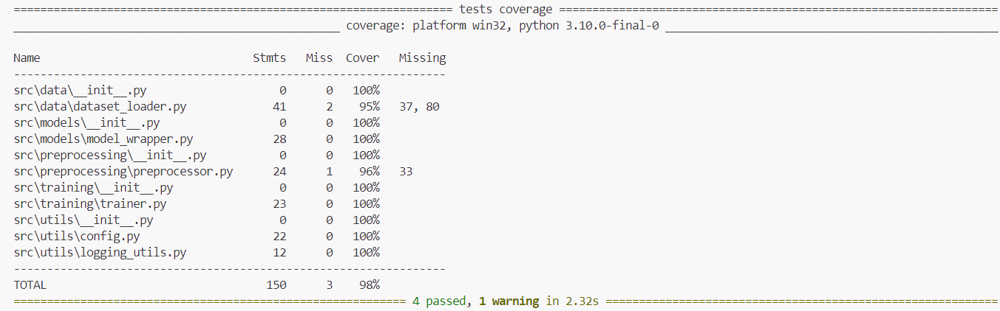
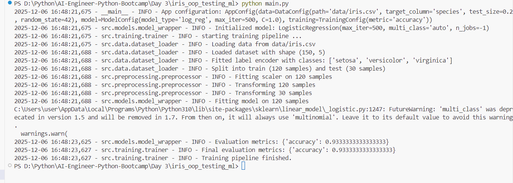

🌸 Day 3 — Iris OOP ML Pipeline with PyTest, Fixtures, Mocks & GitHub Actions CI
A Production-Grade, Testable Machine Learning Pipeline

This project implements a fully modular, fully tested, production-style ML pipeline built using:

Object-Oriented ML architecture

PyTest (fixtures, mocks, coverage)

GitHub Actions CI

Clean Code + Logging

Sklearn: Logistic Regression

Iris dataset (classification)

It represents how FAANG-level ML teams write maintainable, testable, high-quality pipelines.

🚀 1. Project Overview

This project recreates a realistic ML engineering workflow with:

✔ Modular OOP pipeline

CSVDatasetLoader

IrisPreprocessor

ModelWrapper

Trainer

✔ Strong testing practices

Unit tests for every component

Fixtures for deterministic test data

Mocks for pipeline integration

Coverage reports (98%)

✔ Continuous Integration

GitHub Actions automatically tests every commit:

Runs pytest

Checks coverage

Ensures build stability

🧱 2. Project Structure
Day 3/iris_oop_testing_ml/
│
├── data/
│   └── iris.csv
│
├── src/
│   ├── data/
│   │   └── dataset_loader.py
│   ├── preprocessing/
│   │   └── preprocessor.py
│   ├── models/
│   │   └── model_wrapper.py
│   ├── training/
│   │   └── trainer.py
│   └── utils/
│       ├── config.py
│       └── logging_utils.py
│
├── tests/
│   ├── conftest.py
│   ├── test_dataset_loader.py
│   ├── test_preprocessor.py
│   ├── test_model_wrapper.py
│   └── test_trainer.py
│
├── .github/
│   └── workflows/
│       └── ci.yml
│
├── main.py
├── requirements.txt
└── README.md

🧠 3. Pipeline Components (OOP Architecture)
📌 CSVDatasetLoader

Responsible for:

Reading CSV

Validating columns

LabelEncoding target

Stratified train/test split

👉 Keeps data loading logic isolated.

📌 IrisPreprocessor

Includes:

Standardization (StandardScaler)

Fit on train only

Transform train + test

👉 Ensures consistent preprocessing for robust ML.

📌 ModelWrapper

A thin wrapper around Scikit-Learn models.

Handles:

Fit

Predict

Predict Proba

Evaluation (accuracy)

👉 Makes model behavior consistent and testable.

📌 Trainer

Orchestrates the entire ML pipeline:

load → preprocess → train → evaluate

👉 A real-world pattern used in ML production systems.

🧪 4. PyTest: Fixtures, Mocks, Coverage
✔ Fixtures

Reusable test data:

Iris samples

Temporary CSV

Preprocessor

Model wrapper

✔ Mocks

Used in test_trainer.py to avoid:

Real training

Real disk reads

Real preprocessing

This makes pipeline integration tests fast & deterministic.

✔ Coverage
pytest --cov=src --cov-report=term-missing

Achieved:
💚 98% Coverage — production quality.

🔄 5. Continuous Integration (CI)

.github/workflows/ci.yml runs:

Python setup

Install dependencies

Execute PyTest

Generate coverage

Ensures every push is stable and production-ready.

This mirrors real CI pipelines used by:

Google

Meta

Netflix

OpenAI

▶️ 6. Running the Project
Install dependencies
pip install -r requirements.txt

Run pipeline
python main.py

Run all tests
pytest

Run tests with coverage
pytest --cov=src --cov-report=term-missing

🏁 7. Result Summary
✔ Model Accuracy

Logistic Regression achieved:

93.3% accuracy on Iris test split.

✔ Test Results
4 passed, 0 failed

✔ CI Status

Every push triggers a clean CI workflow.

📌 8. Why This Project Matters

This Day 3 project demonstrates real ML engineering, not just model training:

You learned:

Industry-standard folder structure

OOP architecture for ML pipelines

Complete testing suite

Production-level CI/CD

Logging for observability

Clean, modular, maintainable code

This is the exact engineering mindset expected at FAANG, EPAM, Microsoft, DeepMind, OpenAI, etc.

*Pytest result*

*Result:*
